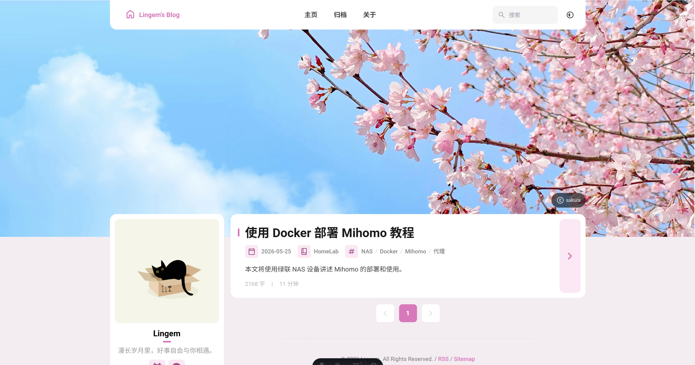

# 🌸 Lingem's Blog

 

基于 [Fuwari](https://github.com/saicaca/fuwari) 主题适当自定义的个人博客。

[**🌐 My Blog (Cloudflare)**](https://lingem.pages.dev)

## ✨ Customization

基于原版 Fuwari 做了以下调整：

- 樱花粉色调，固定主题色
- 自定义横幅与 favicon
- 页脚添加站点统计（运行天数 + 文章数）
- 代码块最大长度限制，滚动条滑动
- 使用 Cloudflare Pages 的 middleware.ts 文件对特定地区进行屏蔽
- 外部链接自动在新窗口打开
