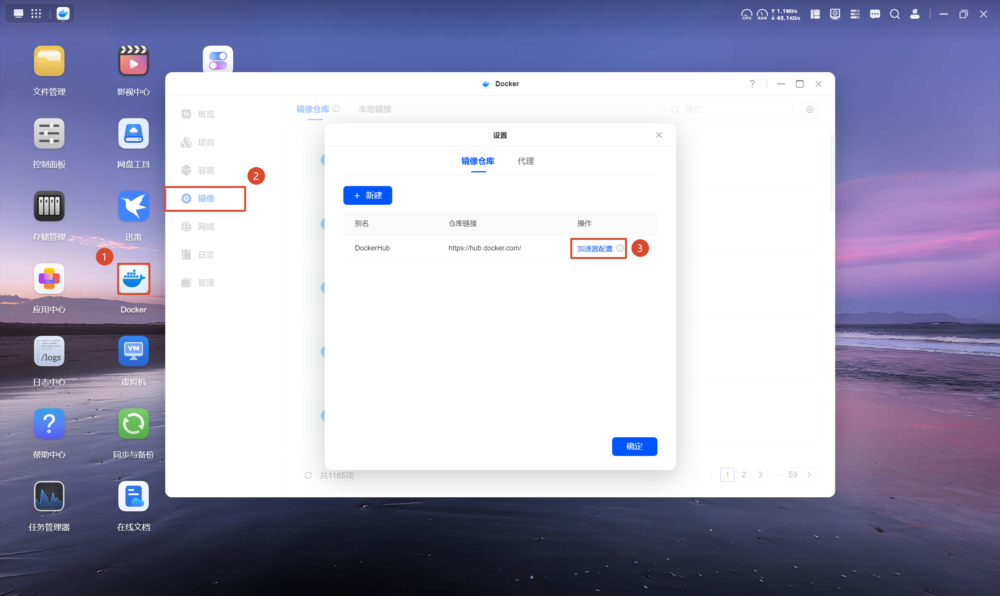
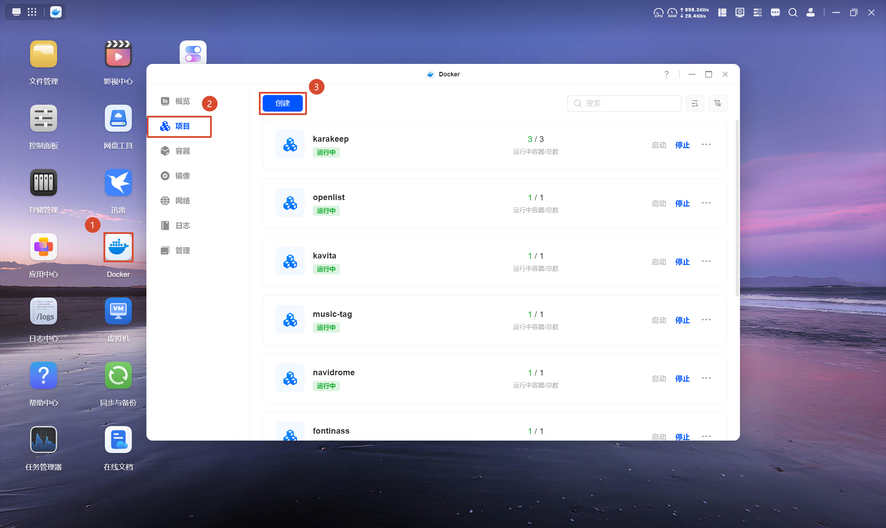
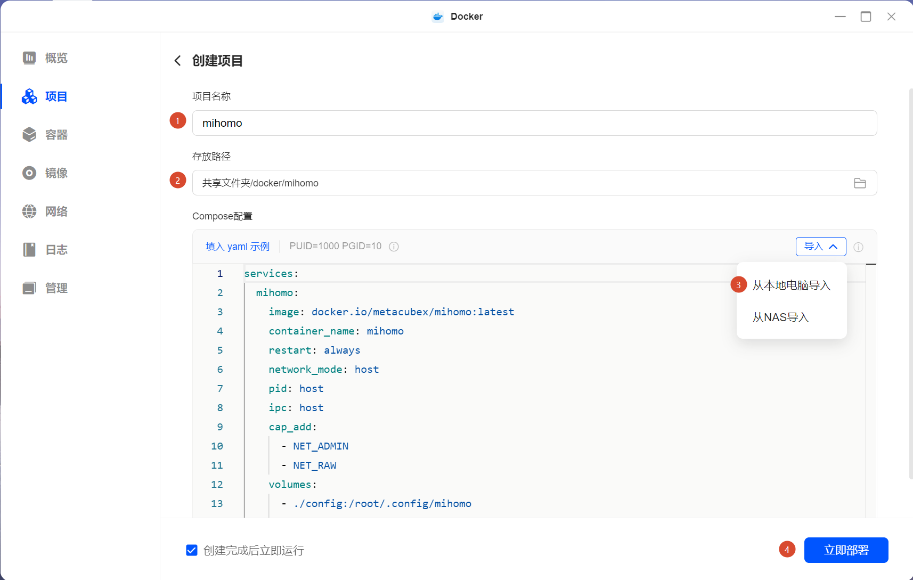
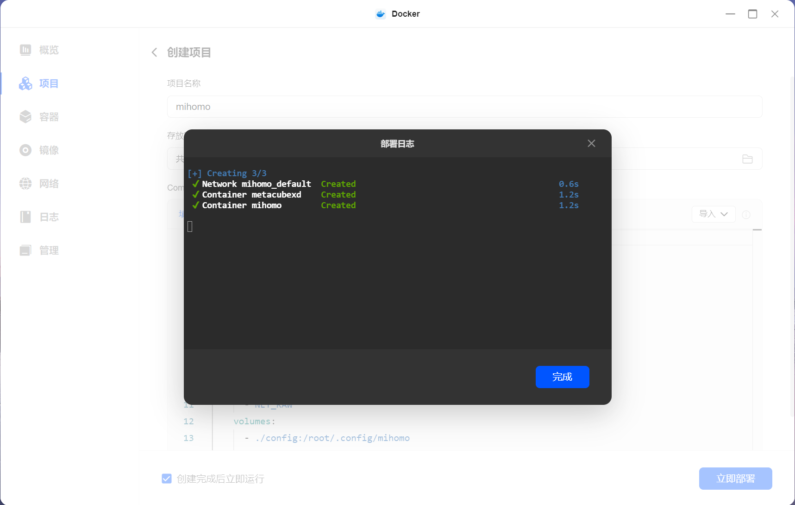
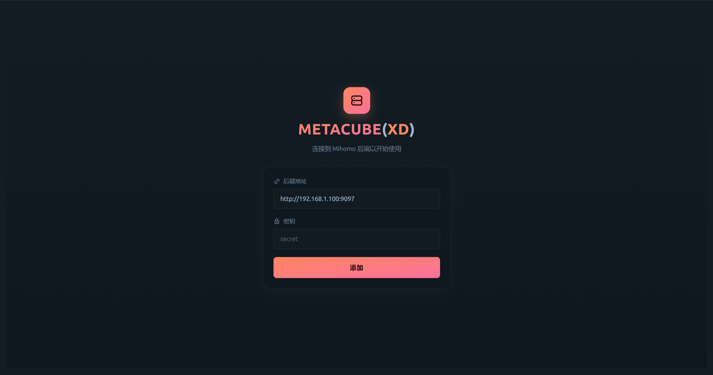
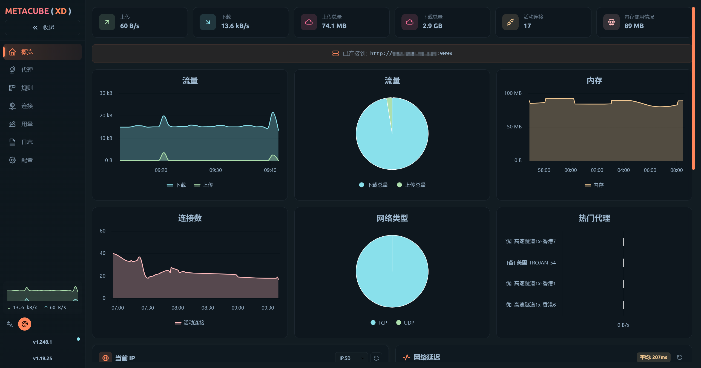
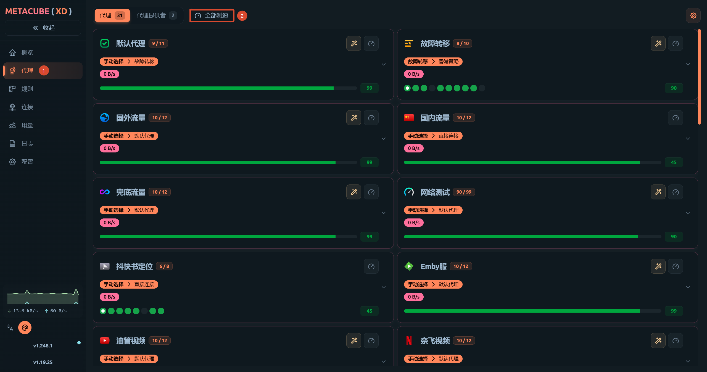

:::caution[法律声明]
根据《中华人民共和国网络安全法》等相关法律法规，代理工具应仅用于合法的网络访问需求（如访问境外学术资源、开发文档等），不得用于访问违法内容或从事任何违法违规活动。请自行确保使用行为符合当地法律法规。
:::

2023 年中我买了一台 NAS，最初的用途很简单——存资源。动漫、漫画、电影、生活资料等等，一股脑儿往里塞。后来慢慢发现 NAS 的玩法远不止于此，开始折腾各种 Docker 项目，比如 Emby 媒体服务器，但我发现：Emby 刮削元数据需要访问 TMDB、Fanart.tv 等外网服务，而 NAS 默认没有代理能力。

我之前用代理的方式很简单——哪台设备需要，就在上面装客户端，方便快捷，但 NAS 不行。我知道一部分人会直接把代理部署在路由器上，这样局域网所有流量都能走代理，但我不太想为了一个代理去折腾软路由，有点小题大做了。

后来，我通过搜索后发现，可以把代理跑在 Docker 容器里。NAS 本身 24 小时在线，Docker 环境又是现成的——完美！

:::tip[友情提示]
如果你希望跟着教程走，最好先通读一遍教程👀再上手。
:::

## 前提条件

本文以我手中的绿联 DX4600-PRO 进行演示，需要：
- NAS 已安装 Docker
- 至少一份可用代理的订阅链接（我个人一主一备，两个订阅）

## 目录结构

请找到你的 docker 文件夹，在其下创建 mihomo 文件夹，再在 mihomo 内创建 config 文件夹。config.yaml 和 docker-compose.yaml 稍后配置完成后上传。

```text
/vol1/docker/mihomo/
├── config/
│   └── config.yaml
└── docker-compose.yaml
```

- **`/vol1/docker/mihomo/`** — 项目目录，Docker 项目统一放在 docker 目录下，按项目名建子文件夹。
- **`config/config.yaml`** — Mihomo 的核心配置文件，包含端口、订阅、规则、DNS、策略组等设定。
- **`docker-compose.yaml`** — compose 编排文件，定义了 mihomo 和 webui 两个容器的镜像、端口、挂载等配置。

## 编写 Mihomo 配置文件

在电脑上创建一个 `config.yaml` 文件，将下面的配置复制进去，并在 `proxy-providers` 部分（第 50-54 行）填入你的实际订阅链接，完成后上传到 NAS 上刚创建的 config 文件夹。

:::tip
该模板来源于一个精选的配置文件仓库，预设了一主一备两个订阅源。如果只有一个订阅链接，可以考虑该仓库的其他优质模板。虽然可以删除其中一个订阅链接，但我不愿意对原模板进行改动。
:::

::github{repo="HenryChiao/MIHOMO_YAMLS"}

```yaml title="config.yaml" showLineNumbers
# >>=====================================<<
# ||                                     ||
# ||      ██████╗  ██████╗  ██████╗      ||
# ||     ██╔════╝ ██╔════╝ ██╔════╝      ||
# ||     ███████╗ ███████╗ ███████╗      ||
# ||     ██╔═══██╗██╔═══██╗██╔═══██╗     ||
# ||     ╚██████╔╝╚██████╔╝╚██████╔╝     ||
# ||      ╚═════╝  ╚═════╝  ╚═════╝      ||
# ||                                     ||
# >>=====================================<<
# 名称: MihomoPro 高大全版
# 地址: https://github.com/666OS/YYDS
# 版本: v26.1.1
# 作者: YYDS666
# 更新: 2026 年 1 月 30 日
# 频道: https://t.me/Pinched666
# 描述: 在proxy-providers加入您的机场订阅链接（代理提供者）

# ==================== 锚点配置 ====================
# 代理提供者模板 - 订阅源基础配置
BaseProvider: &BaseProvider {type: http, interval: 86400, proxy: DIRECT, health-check: {enable: true, url: 'https://www.google.com/generate_204', interval: 300}, filter: '^(?!.*(群|邀请|返利|循环|官网|客服|网站|网址|获取|订阅|流量|到期|机场|下次|版本|官址|备用|过期|已用|联系|邮箱|工单|贩卖|通知|倒卖|防止|国内|地址|频道|无法|说明|使用|提示|特别|访问|支持|教程|关注|更新|作者|加入|USE|USED|TOTAL|EXPIRE|EMAIL|Panel|Channel|Author))'}

# 策略组类型模板 - 定义不同的策略组基础配置
BaseFB: &BaseFB {type: fallback, interval: 200, lazy: true, url: 'https://www.google.com/generate_204'}
BaseCH: &BaseCH {type: load-balance, interval: 200, lazy: true, url: 'https://www.google.com/generate_204', strategy: consistent-hashing, hidden: true}
BaseCR: &BaseCR {type: load-balance, interval: 200, lazy: true, url: 'https://www.google.com/generate_204', strategy: round-robin, hidden: true}
BaseUT: &BaseUT {type: url-test, interval: 200, lazy: true, url: 'https://www.google.com/generate_204', hidden: true}

# 节点筛选正则表达式 - 基于地理位置和关键词过滤
FilterHK: &FilterHK '^(?=.*(?i)(港|🇭🇰|HK|Hong|HKG))(?!.*(排除1|排除2|5x)).*$'
FilterSG: &FilterSG '^(?=.*(?i)(坡|🇸🇬|SG|Sing|SIN|XSP))(?!.*(排除1|排除2|5x)).*$'
FilterJP: &FilterJP '^(?=.*(?i)(日|🇯🇵|JP|Japan|NRT|HND|KIX|CTS|FUK))(?!.*(排除1|排除2|5x)).*$'
FilterKR: &FilterKR '^(?=.*(?i)(韩|🇰🇷|韓|首尔|南朝鲜|KR|KOR|Korea|South))(?!.*(排除1|排除2|5x)).*$'
FilterUS: &FilterUS '^(?=.*(?i)(美|🇺🇸|US|USA|SJC|JFK|LAX|ORD|ATL|DFW|SFO|MIA|SEA|IAD))(?!.*(排除1|排除2|5x)).*$'
FilterTW: &FilterTW '^(?=.*(?i)(台|🇼🇸|🇹🇼|TW|tai|TPE|TSA|KHH))(?!.*(排除1|排除2|5x)).*$'
FilterEU: &FilterEU '^(?=.*(?i)(奥|比|保|克罗地亚|塞|捷|丹|爱沙|芬|法|德|希|匈|爱尔|意|拉|立|卢|马其它|荷|波|葡|罗|斯洛伐|斯洛文|西|瑞|英|🇧🇪|🇨🇿|🇩🇰|🇫🇮|🇫🇷|🇩🇪|🇮🇪|🇮🇹|🇱🇹|🇱🇺|🇳🇱|🇵🇱|🇸🇪|🇬🇧|CDG|FRA|AMS|MAD|BCN|FCO|MUC|BRU))(?!.*(排除1|排除2|5x)).*$'
FilterOT: &FilterOT '^(?!.*(DIRECT|直接连接|美|港|坡|台|新|日|韩|奥|比|保|克罗地亚|塞|捷|丹|爱沙|芬|法|德|希|匈|爱尔|意|拉|立|卢|马其它|荷|波|葡|罗|斯洛伐|斯洛文|西|瑞|英|🇭🇰|🇼🇸|🇹🇼|🇸🇬|🇯🇵|🇰🇷|🇺🇸|🇬🇧|🇦🇹|🇧🇪|🇨🇿|🇩🇰|🇫🇮|🇫🇷|🇩🇪|🇮🇪|🇮🇹|🇱🇹|🇱🇺|🇳🇱|🇵🇱|🇸🇪|HK|TW|SG|JP|KR|US|GB|CDG|FRA|AMS|MAD|BCN|FCO|MUC|BRU|HKG|TPE|TSA|KHH|SIN|XSP|NRT|HND|KIX|CTS|FUK|JFK|LAX|ORD|ATL|DFW|SFO|MIA|SEA|IAD|LHR|LGW))'
FilterAL: &FilterAL '^(?!.*(DIRECT|直接连接|群|邀请|返利|循环|官网|客服|网站|网址|获取|订阅|流量|到期|机场|下次|版本|官址|备用|过期|已用|联系|邮箱|工单|贩卖|通知|倒卖|防止|国内|地址|频道|无法|说明|使用|提示|特别|访问|支持|教程|关注|更新|作者|加入|USE|USED|TOTAL|EXPIRE|EMAIL|Panel|Channel|Author))'

# 策略组代理列表模板 - 预定义的代理节点优先级排序
SelectFB: &SelectFB {type: select, proxies: [故障转移, 香港策略, 狮城策略, 日本策略, 韩国策略, 美国策略, 台湾策略, 欧盟策略, 冷门自选, 全球手动, 直接连接]}
SelectPY: &SelectPY {type: select, proxies: [默认代理, 故障转移, 香港策略, 狮城策略, 日本策略, 韩国策略, 美国策略, 台湾策略, 欧盟策略, 冷门自选, 全球手动, 直接连接]}
SelectDC: &SelectDC {type: select, proxies: [直接连接, 默认代理, 故障转移, 香港策略, 狮城策略, 日本策略, 韩国策略, 美国策略, 台湾策略, 欧盟策略, 冷门自选, 全球手动]}
SelectHK: &SelectHK {type: select, proxies: [香港策略, 默认代理, 故障转移, 狮城策略, 日本策略, 韩国策略, 美国策略, 台湾策略, 欧盟策略, 冷门自选, 全球手动, 直接连接]}
SelectSG: &SelectSG {type: select, proxies: [狮城策略, 默认代理, 故障转移, 香港策略, 日本策略, 韩国策略, 美国策略, 台湾策略, 欧盟策略, 冷门自选, 全球手动, 直接连接]}
SelectUS: &SelectUS {type: select, proxies: [美国策略, 默认代理, 故障转移, 香港策略, 狮城策略, 日本策略, 韩国策略, 台湾策略, 欧盟策略, 冷门自选, 全球手动, 直接连接]}

# ==================== 代理提供者 ====================
# 注意：请提供您的机场订阅链接，每个链接一行，并为每个机场命名，末尾的[优][备]为每个节点添加机场名称前缀，可自定义
proxy-providers:
  # 优质订阅源 - 优质节点集合，使用时请修改
  优质服务商: {<<: *BaseProvider, url: '优质服务商', override: {additional-prefix: '[优] '}}
  # 备用订阅源 - 次优节点集合，使用时请修改
  备用服务商: {<<: *BaseProvider, url: '备用服务商', override: {additional-prefix: '[备] '}}

# ==================== 核心配置 ====================
# 基础配置
mode: rule
port: 7890
socks-port: 7891
redir-port: 7892
mixed-port: 7893
tproxy-port: 7895
ipv6: true
allow-lan: true
unified-delay: true
tcp-concurrent: true
log-level: warning
bind-address: '*'
find-process-mode: 'always'
keep-alive-interval: 15
keep-alive-idle: 600

# 认证配置
authentication:
  - mihomo:yyds666
skip-auth-prefixes:
  - 192.168.1.0/24
  - 192.168.31.0/24
  - 192.168.100.0/24
  - 127.0.0.1/8

# 实验性功能
experimental:
  quic-go-disable-gso: true  
     
# 管理面板配置
external-ui-url: https://github.com/Zephyruso/zashboard/releases/latest/download/dist.zip
external-ui-name: zashboard
external-ui: ui
external-controller: 0.0.0.0:9090
secret: yyds666

# 配置存储
profile:
  store-selected: true
  store-fake-ip: true

# 流量嗅探
sniffer:
  enable: true
  sniff:
    HTTP:
      ports: [80, 8080-8880]
      override-destination: true
    TLS:
      ports: [443, 8443]
    QUIC:
      ports: [443, 8443]
  skip-domain:
    - "Mijia Cloud"
    - "+.push.apple.com"

# TUN模式配置
tun:
  enable: false
  stack: mixed
  dns-hijack:
    - "any:53"
    - "tcp://any:53"
  auto-route: true
  auto-redirect: true
  auto-detect-interface: true
    
# DNS配置
dns:
  enable: true
  ipv6: true
  enhanced-mode: fake-ip
  fake-ip-range: 198.18.0.1/16
  default-nameserver:
    - 119.29.29.29
    - 180.184.1.1
    - 223.5.5.5
  nameserver:
    - https://dns.alidns.com/dns-query
    - https://doh.pub/dns-query
  fake-ip-filter:
    - rule-set:Direct
    - rule-set:Private
    - rule-set:China
    - +.miwifi.com
    - +.docker.io
    - +.market.xiaomi.com
    - +.push.apple.com

# ==================== 代理策略组 ====================
proxy-groups:
  # ==================== 主要策略组 ====================
  - {name: 默认代理,     <<: *SelectFB, icon: https://github.com/Koolson/Qure/raw/master/IconSet/Color/Static.png}
  - {name: 故障转移,     <<: *BaseFB, proxies: [香港策略, 狮城策略, 日本策略, 韩国策略, 美国策略, 台湾策略, 欧盟策略, 全球手动, 冷门自选, 直接连接], icon: https://github.com/Koolson/Qure/raw/master/IconSet/Color/ULB.png}
  - {name: 国外流量,     <<: *SelectPY, icon: https://github.com/Koolson/Qure/raw/master/IconSet/Color/Global.png}
  - {name: 国内流量,     <<: *SelectDC, icon: https://github.com/Koolson/Qure/raw/master/IconSet/Color/China.png}
  - {name: 兜底流量,     <<: *SelectPY, icon: https://github.com/Koolson/Qure/raw/master/IconSet/Color/Final.png}
  - {name: 直接连接,     type: select, proxies: [DIRECT], hidden: true, icon: https://github.com/Koolson/Qure/raw/master/IconSet/Color/Direct.png}

  # ==================== 功能策略组 ====================
  - {name: 网络测试,     <<: *SelectPY, include-all: true, filter: *FilterAL, icon: https://github.com/Koolson/Qure/raw/master/IconSet/Color/Speedtest.png}
  - {name: 抖快书定位,   type: select, proxies: [直接连接, 香港策略, 台湾策略, 狮城策略, 日本策略, 韩国策略, 美国策略, 欧盟策略], icon: https://github.com/Koolson/Qure/raw/master/IconSet/Color/Null_Nation.png}

  # ==================== 媒体服务 ====================
  - {name: Emby服,      <<: *SelectPY, icon: https://github.com/Koolson/Qure/raw/master/IconSet/Color/Emby.png}
  - {name: 油管视频,     <<: *SelectPY, icon: https://github.com/Koolson/Qure/raw/master/IconSet/Color/YouTube.png}
  - {name: 奈飞视频,     <<: *SelectPY, icon: https://github.com/Koolson/Qure/raw/master/IconSet/Color/Netflix.png}
  - {name: 国际媒体,     <<: *SelectPY, icon: https://github.com/Koolson/Qure/raw/master/IconSet/Color/DomesticMedia.png}
  - {name: 新闻媒体,     <<: *SelectUS, icon: https://github.com/Koolson/Qure/raw/master/IconSet/Color/Apple_News.png}

  # ==================== 社交平台 ====================
  - {name: 电报消息,     <<: *SelectPY, icon: https://github.com/Koolson/Qure/raw/master/IconSet/Color/Telegram_X.png}
  - {name: 推特社交,     <<: *SelectPY, icon: https://github.com/Koolson/Qure/raw/master/IconSet/Color/X.png}
  - {name: 社交平台,     <<: *SelectPY, icon: https://github.com/Koolson/Qure/raw/master/IconSet/Color/PBS.png}

  # ==================== 商业服务 ====================
  - {name: 人工智能,     <<: *SelectUS, icon: https://github.com/Koolson/Qure/raw/master/IconSet/Color/AI.png}
  - {name: 货币平台,     <<: *SelectSG, icon: https://raw.githubusercontent.com/Orz-3/mini/master/Alpha/Bitcloud.png}
  - {name: 游戏平台,     <<: *SelectPY, icon: https://github.com/Koolson/Qure/raw/master/IconSet/Color/Game.png}
  - {name: 微软服务,     <<: *SelectPY, icon: https://github.com/Koolson/Qure/raw/master/IconSet/Color/Microsoft.png}
  - {name: 谷歌服务,     <<: *SelectPY, icon: https://github.com/Koolson/Qure/raw/master/IconSet/Color/Google_Search.png}
  - {name: 苹果服务,     <<: *SelectPY, icon: https://github.com/Koolson/Qure/raw/master/IconSet/Color/Apple.png}

  # ==================== 地区策略组 ====================
  - {name: 香港策略,     type: select, proxies: [香港自动, 香港均衡-散列, 香港均衡-轮询], include-all: true, filter: *FilterHK, icon: https://github.com/Koolson/Qure/raw/master/IconSet/Color/Hong_Kong.png}
  - {name: 台湾策略,     type: select, proxies: [台湾自动, 台湾均衡-散列, 台湾均衡-轮询], include-all: true, filter: *FilterTW, icon: https://github.com/Koolson/Qure/raw/master/IconSet/Color/Taiwan.png}
  - {name: 狮城策略,     type: select, proxies: [狮城自动, 狮城均衡-散列, 狮城均衡-轮询], include-all: true, filter: *FilterSG, icon: https://github.com/Koolson/Qure/raw/master/IconSet/Color/Singapore.png}
  - {name: 日本策略,     type: select, proxies: [日本自动, 日本均衡-散列, 日本均衡-轮询], include-all: true, filter: *FilterJP, icon: https://github.com/Koolson/Qure/raw/master/IconSet/Color/Japan.png}
  - {name: 韩国策略,     type: select, proxies: [韩国自动, 韩国均衡-散列, 韩国均衡-轮询], include-all: true, filter: *FilterKR, icon: https://github.com/Koolson/Qure/raw/master/IconSet/Color/Korea.png}
  - {name: 美国策略,     type: select, proxies: [美国自动, 美国均衡-散列, 美国均衡-轮询], include-all: true, filter: *FilterUS, icon: https://github.com/Koolson/Qure/raw/master/IconSet/Color/United_States.png}
  - {name: 欧盟策略,     type: select, proxies: [欧盟自动, 欧盟均衡-散列, 欧盟均衡-轮询], include-all: true, filter: *FilterEU, icon: https://github.com/Koolson/Qure/raw/master/IconSet/Color/European_Union.png}

  # ==================== 其他策略组 ====================
  - {name: 冷门自选,     type: select, include-all: true, filter: *FilterOT, icon: https://github.com/Koolson/Qure/raw/master/IconSet/Color/Europe_Map.png}
  - {name: 全球手动,     type: select, include-all: true, filter: *FilterAL, icon: https://github.com/Koolson/Qure/raw/master/IconSet/Color/Clubhouse.png}

  # ==================== 自动测速组 ====================
  - {name: 香港自动,     <<: *BaseUT, include-all: true, filter: *FilterHK, icon: https://github.com/Koolson/Qure/raw/master/IconSet/Color/Auto.png}
  - {name: 台湾自动,     <<: *BaseUT, include-all: true, filter: *FilterTW, icon: https://github.com/Koolson/Qure/raw/master/IconSet/Color/Auto.png}
  - {name: 狮城自动,     <<: *BaseUT, include-all: true, filter: *FilterSG, icon: https://github.com/Koolson/Qure/raw/master/IconSet/Color/Auto.png}
  - {name: 日本自动,     <<: *BaseUT, include-all: true, filter: *FilterJP, icon: https://github.com/Koolson/Qure/raw/master/IconSet/Color/Auto.png}
  - {name: 韩国自动,     <<: *BaseUT, include-all: true, filter: *FilterKR, icon: https://github.com/Koolson/Qure/raw/master/IconSet/Color/Auto.png}
  - {name: 美国自动,     <<: *BaseUT, include-all: true, filter: *FilterUS, icon: https://github.com/Koolson/Qure/raw/master/IconSet/Color/Auto.png}
  - {name: 欧盟自动,     <<: *BaseUT, include-all: true, filter: *FilterEU, icon: https://github.com/Koolson/Qure/raw/master/IconSet/Color/Auto.png}

  # ==================== 负载均衡-散列 ====================
  - {name: 香港均衡-散列, <<: *BaseCH, include-all: true, filter: *FilterHK, icon: https://github.com/Koolson/Qure/raw/master/IconSet/Color/Round_Robin_1.png}
  - {name: 台湾均衡-散列, <<: *BaseCH, include-all: true, filter: *FilterTW, icon: https://github.com/Koolson/Qure/raw/master/IconSet/Color/Round_Robin_1.png}
  - {name: 狮城均衡-散列, <<: *BaseCH, include-all: true, filter: *FilterSG, icon: https://github.com/Koolson/Qure/raw/master/IconSet/Color/Round_Robin_1.png}
  - {name: 日本均衡-散列, <<: *BaseCH, include-all: true, filter: *FilterJP, icon: https://github.com/Koolson/Qure/raw/master/IconSet/Color/Round_Robin_1.png}
  - {name: 韩国均衡-散列, <<: *BaseCH, include-all: true, filter: *FilterKR, icon: https://github.com/Koolson/Qure/raw/master/IconSet/Color/Round_Robin_1.png}
  - {name: 美国均衡-散列, <<: *BaseCH, include-all: true, filter: *FilterUS, icon: https://github.com/Koolson/Qure/raw/master/IconSet/Color/Round_Robin_1.png}
  - {name: 欧盟均衡-散列, <<: *BaseCH, include-all: true, filter: *FilterEU, icon: https://github.com/Koolson/Qure/raw/master/IconSet/Color/Round_Robin_1.png}

  # ==================== 负载均衡-轮询 ====================
  - {name: 香港均衡-轮询, <<: *BaseCR, include-all: true, filter: *FilterHK, icon: https://github.com/Koolson/Qure/raw/master/IconSet/Color/Round_Robin.png}
  - {name: 台湾均衡-轮询, <<: *BaseCR, include-all: true, filter: *FilterTW, icon: https://github.com/Koolson/Qure/raw/master/IconSet/Color/Round_Robin.png}
  - {name: 狮城均衡-轮询, <<: *BaseCR, include-all: true, filter: *FilterSG, icon: https://github.com/Koolson/Qure/raw/master/IconSet/Color/Round_Robin.png}
  - {name: 日本均衡-轮询, <<: *BaseCR, include-all: true, filter: *FilterJP, icon: https://github.com/Koolson/Qure/raw/master/IconSet/Color/Round_Robin.png}
  - {name: 韩国均衡-轮询, <<: *BaseCR, include-all: true, filter: *FilterKR, icon: https://github.com/Koolson/Qure/raw/master/IconSet/Color/Round_Robin.png}
  - {name: 美国均衡-轮询, <<: *BaseCR, include-all: true, filter: *FilterUS, icon: https://github.com/Koolson/Qure/raw/master/IconSet/Color/Round_Robin.png}
  - {name: 欧盟均衡-轮询, <<: *BaseCR, include-all: true, filter: *FilterEU, icon: https://github.com/Koolson/Qure/raw/master/IconSet/Color/Round_Robin.png}

# ==================== 规则路由 ====================
rules: 
  # 拦截规则
  - RULE-SET,Tracking,REJECT
  - RULE-SET,Advertising,REJECT
  - AND,((DST-PORT,443),(NETWORK,UDP),(NOT,((GEOIP,CN)))),REJECT  # 阻止海外 QUIC
  
  # 域名规则
  - RULE-SET,LocationDKS,抖快书定位
  - RULE-SET,Private,直接连接
  - RULE-SET,Direct,直接连接
  - RULE-SET,XPTV,直接连接
  - RULE-SET,Download,直接连接
  - RULE-SET,AppleCN,直接连接
  - RULE-SET,AI,人工智能
  - DOMAIN-KEYWORD,speedtest,网络测试
  - RULE-SET,Speedtest,网络测试
  - RULE-SET,Twitter,推特社交
  - RULE-SET,Telegram,电报消息
  - RULE-SET,SocialMedia,社交平台
  - RULE-SET,NewsMedia,新闻媒体
  - RULE-SET,Games,游戏平台
  - RULE-SET,Crypto,货币平台
  - RULE-SET,Emby,Emby服
  - RULE-SET,Netflix,奈飞视频
  - RULE-SET,YouTube,油管视频
  - RULE-SET,Streaming,国际媒体
  - RULE-SET,Apple,苹果服务 
  - RULE-SET,Google,谷歌服务
  - RULE-SET,Microsoft,微软服务
  - RULE-SET,Proxy,国外流量
  - RULE-SET,China,国内流量

  # IP规则
  - RULE-SET,AdvertisingIP,REJECT,no-resolve
  - RULE-SET,PrivateIP,直接连接,no-resolve
  - RULE-SET,XPTVIP,直接连接,no-resolve
  - RULE-SET,AIIP,人工智能,no-resolve
  - RULE-SET,TelegramIP,电报消息,no-resolve
  - RULE-SET,SocialMediaIP,社交平台,no-resolve
  - RULE-SET,EmbyIP,Emby服,no-resolve
  - RULE-SET,NetflixIP,奈飞视频,no-resolve
  - RULE-SET,StreamingIP,国际媒体,no-resolve
  - RULE-SET,GoogleIP,谷歌服务,no-resolve
  - RULE-SET,ProxyIP,国外流量,no-resolve
  - RULE-SET,ChinaIP,国内流量

  # 兜底规则
  - MATCH,兜底流量

# ==================== 规则集 ====================
# 规则集行为模板
BehaviorDN: &BehaviorDN {type: http, behavior: domain, format: mrs, interval: 86400}
BehaviorIP: &BehaviorIP {type: http, behavior: ipcidr, format: mrs, interval: 86400}

# 规则提供者
rule-providers:  
  # 域名规则
  Tracking:       {<<: *BehaviorDN, url: https://github.com/666OS/rules/raw/release/mihomo/domain/Tracking.mrs}
  Advertising:    {<<: *BehaviorDN, url: https://github.com/666OS/rules/raw/release/mihomo/domain/Advertising.mrs} 
  Direct:         {<<: *BehaviorDN, url: https://github.com/666OS/rules/raw/release/mihomo/domain/Direct.mrs}
  LocationDKS:    {<<: *BehaviorDN, url: https://github.com/666OS/rules/raw/release/mihomo/domain/LocationDKS.mrs}
  Private:        {<<: *BehaviorDN, url: https://github.com/666OS/rules/raw/release/mihomo/domain/Private.mrs}
  Download:       {<<: *BehaviorDN, url: https://github.com/666OS/rules/raw/release/mihomo/domain/Download.mrs}
  Speedtest:      {<<: *BehaviorDN, url: https://github.com/666OS/rules/raw/release/mihomo/domain/Speedtest.mrs}
  AI:             {<<: *BehaviorDN, url: https://github.com/666OS/rules/raw/release/mihomo/domain/AI.mrs}  
  Telegram:       {<<: *BehaviorDN, url: https://github.com/666OS/rules/raw/release/mihomo/domain/Telegram.mrs}
  Twitter:        {<<: *BehaviorDN, url: https://github.com/666OS/rules/raw/release/mihomo/domain/Twitter.mrs}  
  SocialMedia:    {<<: *BehaviorDN, url: https://github.com/666OS/rules/raw/release/mihomo/domain/SocialMedia.mrs}
  NewsMedia:      {<<: *BehaviorDN, url: https://github.com/666OS/rules/raw/release/mihomo/domain/NewsMedia.mrs}
  Games:          {<<: *BehaviorDN, url: https://github.com/666OS/rules/raw/release/mihomo/domain/Games.mrs}
  Crypto:         {<<: *BehaviorDN, url: https://github.com/666OS/rules/raw/release/mihomo/domain/Crypto.mrs}
  Netflix:        {<<: *BehaviorDN, url: https://github.com/666OS/rules/raw/release/mihomo/domain/Netflix.mrs}
  YouTube:        {<<: *BehaviorDN, url: https://github.com/666OS/rules/raw/release/mihomo/domain/YouTube.mrs}
  XPTV:           {<<: *BehaviorDN, url: https://github.com/666OS/rules/raw/release/mihomo/domain/XPTV.mrs}  
  Emby:           {<<: *BehaviorDN, url: https://github.com/666OS/rules/raw/release/mihomo/domain/Emby.mrs}
  Streaming:      {<<: *BehaviorDN, url: https://github.com/666OS/rules/raw/release/mihomo/domain/Streaming.mrs}  
  AppleCN:        {<<: *BehaviorDN, url: https://github.com/666OS/rules/raw/release/mihomo/domain/AppleCN.mrs}
  Apple:          {<<: *BehaviorDN, url: https://github.com/666OS/rules/raw/release/mihomo/domain/Apple.mrs}
  Google:         {<<: *BehaviorDN, url: https://github.com/666OS/rules/raw/release/mihomo/domain/Google.mrs}
  Microsoft:      {<<: *BehaviorDN, url: https://github.com/666OS/rules/raw/release/mihomo/domain/Microsoft.mrs}  
  Facebook:       {<<: *BehaviorDN, url: https://github.com/666OS/rules/raw/release/mihomo/domain/Facebook.mrs}
  Proxy:          {<<: *BehaviorDN, url: https://github.com/666OS/rules/raw/release/mihomo/domain/Proxy.mrs}
  China:          {<<: *BehaviorDN, url: https://github.com/666OS/rules/raw/release/mihomo/domain/China.mrs}

  # IP规则
  AdvertisingIP:  {<<: *BehaviorIP, url: https://github.com/666OS/rules/raw/release/mihomo/ip/Advertising.mrs}
  PrivateIP:      {<<: *BehaviorIP, url: https://github.com/666OS/rules/raw/release/mihomo/ip/Private.mrs}
  AIIP:           {<<: *BehaviorIP, url: https://github.com/666OS/rules/raw/release/mihomo/ip/AI.mrs}
  TelegramIP:     {<<: *BehaviorIP, url: https://github.com/666OS/rules/raw/release/mihomo/ip/Telegram.mrs}  
  SocialMediaIP:  {<<: *BehaviorIP, url: https://github.com/666OS/rules/raw/release/mihomo/ip/SocialMedia.mrs}  
  XPTVIP:         {<<: *BehaviorIP, url: https://github.com/666OS/rules/raw/release/mihomo/ip/XPTV.mrs}
  EmbyIP:         {<<: *BehaviorIP, url: https://github.com/666OS/rules/raw/release/mihomo/ip/Emby.mrs}
  NetflixIP:      {<<: *BehaviorIP, url: https://github.com/666OS/rules/raw/release/mihomo/ip/Netflix.mrs}
  StreamingIP:    {<<: *BehaviorIP, url: https://github.com/666OS/rules/raw/release/mihomo/ip/Streaming.mrs}  
  GoogleIP:       {<<: *BehaviorIP, url: https://github.com/666OS/rules/raw/release/mihomo/ip/Google.mrs}
  FacebookIP:     {<<: *BehaviorIP, url: https://github.com/666OS/rules/raw/release/mihomo/ip/Facebook.mrs}  
  ProxyIP:        {<<: *BehaviorIP, url: https://github.com/666OS/rules/raw/release/mihomo/ip/Proxy.mrs} 
  ChinaIP:        {<<: *BehaviorIP, url: https://github.com/666OS/rules/raw/release/mihomo/ip/China.mrs}
# ==================== EOF ====================
```

### 配置说明

:::caution[external-controller 与安全]
`external-controller: "0.0.0.0:9090"` 意味着局域网内任何设备都能访问 Mihomo 的 API，如果你认为不安全，可以设置为指定设备的 IP。配置中已预设 `secret: yyds666`，**强烈建议改为你自己的随机字符串**，WebUI 连接时也需填写同样的密钥。
:::

:::tip[TUN 模式]
TUN 模式会在系统层创建一个虚拟网卡，让所有流量自动走代理。当前默认关闭 `enable: false`。如果你只是想让其他设备或 Docker 容器通过代理连接，无需开启 TUN；但如果希望 NAS 自身所有流量都走代理，将 TUN 部分的 `enable: false` 改为 `true` 即可。
:::

## 编写 docker-compose 配置文件

在电脑上创建一个 `docker-compose.yaml` 文件，将下面的配置复制进去，如有需要可以自行更改配置，然后保存。

```yaml title="docker-compose.yaml" showLineNumbers
services:
  # ==================== Mihomo 代理核心 ====================
  mihomo:
    image: docker.io/metacubex/mihomo:latest  # 官方镜像
    container_name: mihomo
    restart: always                            # 开机自启，异常退出自动重启
    network_mode: host                         # 使用宿主机网络，否则无法代理其他容器
    pid: host                                  # 共享宿主机 PID 命名空间
    ipc: host                                  # 共享宿主机 IPC 命名空间
    cap_add:
      - ALL                                    # 赋予全部内核能力（TUN 模式需要）
    security_opt:
      - apparmor=unconfined                    # 关闭 AppArmor 限制
    volumes:
      - ./config:/root/.config/mihomo          # 挂载配置目录
      - /dev/net/tun:/dev/net/tun              # TUN 虚拟网卡设备
    environment:
      - TZ=Asia/Shanghai                       # 时区

  # ==================== WebUI 管理面板 ====================
  webui:
    image: ghcr.io/metacubex/metacubexd:latest # WebUI 镜像
    container_name: metacubexd
    restart: always
    network_mode: bridge                       # 桥接模式，通过端口映射暴露
    ports:
      - "9097:80"                              # 宿主机 9097 → 容器 80
```

## 部署 Mihomo 与访问

上述两个配置文件 `config.yaml` 和 `docker-compose.yaml` 已经编辑完成，在进入部署之前，有一项重要工作需要提前做好。

:::important[镜像加速]
因为在中国大陆境内访问镜像不稳定，需要配置镜像加速。前往 Docker → 镜像 → 设置 → 镜像加速 → 加速器配置，填入加速地址，例如 `https://docker.1panel.live`，点击确定后，稍等片刻即可开始部署。
:::



下面开始部署，打开绿联云 → Docker → 项目 → 创建，填写项目名称为 mihomo，存放路径为刚才创建的 mihomo 文件夹，然后导入 `docker-compose.yaml` 文件，最后点击「立即部署」即可。







点击完成后，在浏览器打开 `http://NAS_IP:9097`，填写后端连接信息：

| 字段 | 值 |
|------|-----|
| 后端地址 | `http://NAS_IP:9090` |
| 密钥 | 填写 `config.yaml` 中 `secret` 字段的值（默认为 `yyds666`，建议已改为自己的） |

:::tip
`NAS_IP` 换成你的 NAS 实际 IP，例如 `http://192.168.1.100:9097`。
:::

:::important[无法连接后端]
此处请注意，我在第一次填写后端地址和密钥尝试连接后，会显示后端连接失败的错误信息，尽管我输入的是正确的。目前我并没有找到原因，如果你也出现同样的情况，请尝试清除浏览器缓存、重启 Docker 容器、重启 NAS 设备。成功进入后端后，就不会再出现该问题。
:::





## 使用说明

部署完成后，大部分情况不用动，规则已自动分流。如果需要查看节点速度情况，在面板中找到代理，点击全部测速即可。



如需使用代理，请在使用设备上找到代理选项，一般都在网络设置中，然后据情况填入以下值：

| 参数 | 值 |
|------|-----|
| 代理类型 | HTTP |
| 服务器 | NAS 的 IP |
| 端口 | `7890` |

在已连接代理的设备上打开浏览器访问 `https://www.google.com`，如果能正常打开，说明代理已生效。

### Docker 容器使用代理

如果特定的 Docker 容器需要使用代理，在其 `docker-compose.yaml` 中添加以下环境变量：

| 变量名 | 值 |
|--------|-----|
| `HTTP_PROXY` | `http://NAS_IP:7890` |
| `HTTPS_PROXY` | `http://NAS_IP:7890` |

配置后**重启容器**即可生效。

:::tip[以下内容可跳过]
如果你的代理使用是正常的，不需要手动选择节点，可以直接跳过下面的内容。
:::

### 手动指定节点

如果出现以下加载速度过慢的情况，可以尝试手动指定节点。

#### 什么时候需要手动指定节点

| 场景 | 说明 |
|------|------|
| 某个网站打不开或加载慢 | 自动选择的节点对该网站不友好 |
| 特定服务需要固定地区 | 如 ChatGPT 需要美国节点、Netflix 需要解锁节点 |
| 自动测速选了高倍率节点 | 想手动切换到更经济的节点 |
| 某地区节点集体故障 | 需要临时切换到其他地区 |

#### 策略组结构

```
默认代理 ─────────────┐
国外流量（Proxy） ────┤
兜底流量 ─────────────┤    这几个是"总开关"级策略组
国内流量 ─────────────┘
         │
         ▼
  ┌──────────────────────────────────────┐
  │  故障转移 / 香港策略 / 日本策略 / ... │  ← 地区/自动策略组
  │  Emby服 / 油管 / 奈飞 / AI / ...    │  ← 功能分流组
  └──────────────────────────────────────┘
         │
         ▼
  ┌──────────────────────────────────────┐
  │  香港自动 / 日本自动 / ...           │  ← url-test 自动选最快
  │  香港均衡-散列 / 轮询 ...           │  ← 负载均衡
  │  全球手动 / 冷门自选                 │  ← 全部节点平铺
  └──────────────────────────────────────┘
```

#### 方式一：临时切换（只影响特定服务）

**适用场景**：某个网站/应用走错了节点，只想修正这一个服务。

**操作步骤**：

1. 在 Metacubexd 面板中找到该服务对应的策略组
2. 点击策略组名称，展开节点列表
3. 选择合适的地区策略组

**常见功能策略组对照表**：

| 服务 | 策略组名称 | 默认指向 | 建议切换目标 |
|------|-----------|---------|-------------|
| YouTube | 油管视频 | 默认代理 | 日本策略 / 狮城策略 |
| Netflix | 奈飞视频 | 默认代理 | 美国策略 / 狮城策略 |
| ChatGPT | 人工智能 | 美国策略 | 美国自动 / 具体美国节点 |
| Emby | Emby服 | 默认代理 | 狮城策略 / 香港策略 |
| Telegram | 电报消息 | 默认代理 | 香港策略 / 狮城策略 |
| Twitter/X | 推特社交 | 默认代理 | 日本策略 / 美国策略 |
| 游戏平台 | 游戏平台 | 默认代理 | 日本策略 / 香港策略 |

**示例**：YouTube 卡顿，想切换到日本节点

```
1. 打开 Metacubexd → Proxies 页面
2. 找到「油管视频」策略组
3. 点击展开，从「默认代理」切换到「日本策略」
4. 日本策略内部会自动选最快的日本节点
```

#### 方式二：更改默认节点（影响全局）

**适用场景**：所有国外网站都慢，想全局更换默认节点。

**操作步骤**：

1. 找到「默认代理」策略组
2. 从「故障转移」切换到目标地区策略组
3. 所有未单独分流的服务都会跟随这个设置

**可选目标**：

| 目标 | 效果 |
|------|------|
| 故障转移 | 按优先级自动找可用节点（默认） |
| 香港策略 | 所有流量默认走香港 |
| 狮城策略 | 所有流量默认走新加坡 |
| 日本策略 | 所有流量默认走日本 |
| 美国策略 | 所有流量默认走美国 |
| 全球手动 | 平铺所有节点，手动点选 |

**示例**：全局切换到狮城节点

```
1. 打开 Metacubexd → 代理 页面
2. 找到「默认代理」策略组
3. 点击展开，从「故障转移」切换到「狮城策略」
4. 所有未单独分流的国外流量都会走狮城
```

#### 地区策略组内部的选择

每个地区策略组（如「日本策略」）内部包含：

| 子选项 | 类型 | 说明 |
|--------|------|------|
| 日本自动 | url-test | 自动测速选最快日本节点 |
| 日本均衡-散列 | load-balance | 一致性哈希分配 |
| 日本均衡-轮询 | load-balance | 轮询分配 |
| 日本-SS | 具体节点 | 平铺的所有日本节点 |
| 日本-V2Ray | 具体节点 | ... |

**手动指定时**：
- 想自动选最快 → 选「日本自动」
- 想固定某个节点 → 往下翻，点具体节点名称

#### 快速排查节点质量

1. 找到「网络测试」策略组
2. 展开后能看到所有节点的实时延迟
3. 记住延迟低的节点名字
4. 去对应策略组手动选择该节点

## 总结

本文是我部署和使用 Mihomo 的全过程，如果能对你有所帮助，那就再好不过了。自从我买了 NAS 之后，也是打开了新世界的大门，我知道 NAS 原先只是用来存储备份文件，但现在已经慢慢演变成了一个强大的多功能服务器，可以运行各种应用服务，满足各种需求。Mihomo 只是众多出色项目之一，希望以后我能找到更多好玩有用的项目分享出来。

最后，感谢大佬们的无私分享！以下为本文参考的链接：

- [Mihomo 官网](https://github.com/MetaCubeX/mihomo)
- [Mihomo 的千种配置](https://github.com/HenryChiao/MIHOMO_YAMLS)
- [在 docker 中使用 mihomo - windowbr 的博客](https://windowbr.top/2024/11/02/mihomo-docker/)
