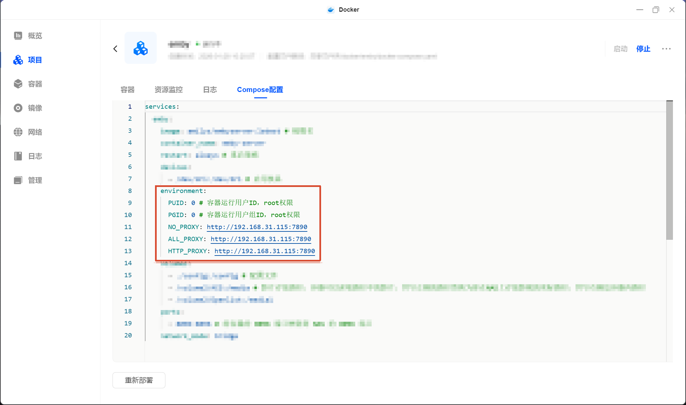

:::caution[法律声明]
根据《中华人民共和国网络安全法》等相关法律法规，代理工具应仅用于合法的网络访问需求（如访问境外学术资源、开发文档等），不得用于访问违法内容或从事任何违法违规活动。请自行确保使用行为符合当地法律法规。
:::

2023 年中我买了一台 NAS，最初的用途很简单——存资源。动漫、漫画、电影、生活资料等等，一股脑往里塞。后来慢慢发现 NAS 的玩法远不止于此，开始折腾各种 Docker 项目，比如 Emby 媒体服务器，但我发现：Emby 刮削元数据需要访问 TMDB、Fanart.tv 等外网服务，而 NAS 默认没有代理能力。

我之前用代理的方式很简单——哪台设备需要，就在上面装客户端，方便快捷，但 NAS 不行。我知道一部分人会直接把代理部署在路由器上，这样局域网所有流量都能走代理，但我不太想为了一个代理去折腾软路由，有点小题大做了。

后来，我通过搜索后发现，可以把代理跑在 Docker 容器里。NAS 本身 24 小时在线，Docker 环境又是现成的——完美！

:::tip[友情提示]
如果你希望跟着教程走，最好先通读一遍教程👀再上手。
:::

## 前提条件

本文以我手中的绿联 DX4600-PRO 进行演示，需要：
- 绿联云 电脑客户端
- NAS 已安装 Docker
- 至少一份可用代理的订阅链接

## 目录结构

请找到你的 docker 文件夹，在其下创建 mihomo 文件夹，再在 mihomo 内创建 config 文件夹。config.yaml 和 docker-compose.yaml 稍后配置完成后上传。

```text
/vol1/docker/mihomo/
├── config/
│   └── config.yaml
└── docker-compose.yaml
```

- **`/vol1/docker/mihomo/`** — 项目目录，Docker 项目统一放在 docker 目录下，按项目名建子文件夹。
- **`config/config.yaml`** — Mihomo 的核心配置文件，包含端口、订阅、规则、DNS、策略组等设定。
- **`docker-compose.yaml`** — compose 编排文件，定义了 mihomo 和 webui 两个容器的镜像、端口、挂载等配置。

## 编写 Mihomo 配置文件

在电脑上创建一个 `config.yaml` 文件，将下面的配置复制进去，并将 `此处填写订阅链接` 替换为你的实际订阅链接，完成后上传到 NAS 上刚创建的 config 文件夹。

:::tip
以下配置是我请 AI 编写的非常简陋的模板，仅做到能用。如果需要自定义（如调整策略组、分流规则），可以查阅 Mihomo 官网手册进行修改，但我个人强烈建议参考大佬们的精选模板，或让 AI 根据你的情况帮你定制。
:::

::github{repo="MetaCubeX/mihomo"}
::github{repo="HenryChiao/MIHOMO_YAMLS"}

```yaml title="config.yaml" showLineNumbers
# ============================================================
# Mihomo (Clash Meta) 通用模板
# 适用于任意 Clash 订阅，策略组简洁，开箱即用
# ============================================================

# -------------------- 端口配置 --------------------
mixed-port: 7890
redir-port: 7892
tproxy-port: 7893

allow-lan: true
bind-address: "0.0.0.0"
mode: rule
log-level: info
ipv6: false
external-controller: "0.0.0.0:9090"
secret: ""

# -------------------- 订阅配置 --------------------
proxy-providers:
  subscribe:
    type: http
    url: "此处填写订阅链接"
    path: ./profiles/sub.yaml
    interval: 86400
    health-check:
      enable: true
      url: https://www.gstatic.com/generate_204
      interval: 300

# -------------------- 规则集 --------------------
rule-providers:
  reject:
    type: http
    behavior: domain
    url: "https://cdn.jsdelivr.net/gh/Loyalsoldier/clash-rules@release/reject.txt"
    path: ./ruleset/reject.yaml
    interval: 86400

  icloud:
    type: http
    behavior: domain
    url: "https://cdn.jsdelivr.net/gh/Loyalsoldier/clash-rules@release/icloud.txt"
    path: ./ruleset/icloud.yaml
    interval: 86400

  apple:
    type: http
    behavior: domain
    url: "https://cdn.jsdelivr.net/gh/Loyalsoldier/clash-rules@release/apple.txt"
    path: ./ruleset/apple.yaml
    interval: 86400

  google:
    type: http
    behavior: domain
    url: "https://cdn.jsdelivr.net/gh/Loyalsoldier/clash-rules@release/google.txt"
    path: ./ruleset/google.yaml
    interval: 86400

  proxy:
    type: http
    behavior: domain
    url: "https://cdn.jsdelivr.net/gh/Loyalsoldier/clash-rules@release/proxy.txt"
    path: ./ruleset/proxy.yaml
    interval: 86400

  direct:
    type: http
    behavior: domain
    url: "https://cdn.jsdelivr.net/gh/Loyalsoldier/clash-rules@release/direct.txt"
    path: ./ruleset/direct.yaml
    interval: 86400

  gfw:
    type: http
    behavior: domain
    url: "https://cdn.jsdelivr.net/gh/Loyalsoldier/clash-rules@release/gfw.txt"
    path: ./ruleset/gfw.yaml
    interval: 86400

  greatfire:
    type: http
    behavior: domain
    url: "https://cdn.jsdelivr.net/gh/Loyalsoldier/clash-rules@release/greatfire.txt"
    path: ./ruleset/greatfire.yaml
    interval: 86400

  tld-not-cn:
    type: http
    behavior: domain
    url: "https://cdn.jsdelivr.net/gh/Loyalsoldier/clash-rules@release/tld-not-cn.txt"
    path: ./ruleset/tld-not-cn.yaml
    interval: 86400

  telegramcidr:
    type: http
    behavior: ipcidr
    url: "https://cdn.jsdelivr.net/gh/Loyalsoldier/clash-rules@release/telegramcidr.txt"
    path: ./ruleset/telegramcidr.yaml
    interval: 86400

  cncidr:
    type: http
    behavior: ipcidr
    url: "https://cdn.jsdelivr.net/gh/Loyalsoldier/clash-rules@release/cncidr.txt"
    path: ./ruleset/cncidr.yaml
    interval: 86400

  lancidr:
    type: http
    behavior: ipcidr
    url: "https://cdn.jsdelivr.net/gh/Loyalsoldier/clash-rules@release/lancidr.txt"
    path: ./ruleset/lancidr.yaml
    interval: 86400

  applications:
    type: http
    behavior: classical
    url: "https://cdn.jsdelivr.net/gh/Loyalsoldier/clash-rules@release/applications.txt"
    path: ./ruleset/applications.yaml
    interval: 86400

# -------------------- 规则 --------------------
rules:
  # 去广告 / 隐私追踪
  - RULE-SET,reject,REJECT

  # 局域网 / 私有地址直连
  - RULE-SET,lancidr,DIRECT
  - RULE-SET,applications,DIRECT

  # 国内域名 / IP 直连
  - RULE-SET,icloud,DIRECT
  - RULE-SET,apple,DIRECT
  - RULE-SET,google,PROXY
  - RULE-SET,direct,DIRECT
  - RULE-SET,cncidr,DIRECT

  # 代理
  - RULE-SET,telegramcidr,PROXY
  - RULE-SET,gfw,PROXY
  - RULE-SET,greatfire,PROXY
  - RULE-SET,proxy,PROXY
  - RULE-SET,tld-not-cn,PROXY

  # 兜底
  - GEOIP,CN,DIRECT
  - MATCH,PROXY

# -------------------- DNS 防污染 --------------------
dns:
  enable: true
  listen: 0.0.0.0:53
  ipv6: false
  default-nameserver:
    - 223.5.5.5
    - 119.29.29.29
  enhanced-mode: fake-ip
  fake-ip-range: 198.18.0.1/16
  fake-ip-filter:
    - "*.lan"
    - "*.local"
    - "*.home.arpa"
    - "ntp.*"
    - "*.ntp.org"
    - "+.market.xiaomi.com"
    - "+.stun.*"
    - "time.*.com"
    - "time.*.gov"
    - "time.*.edu.cn"
    - "time.*.apple.com"
    - "time1.*.com"
    - "time2.*.com"
    - "time3.*.com"
    - "time4.*.com"
    - "time5.*.com"
    - "time6.*.com"
    - "time7.*.com"
    - "*.time.edu.cn"
    - "*.time.edu.com"
  nameserver:
    - https://doh.pub/dns-query
    - https://dns.alidns.com/dns-query
    - 223.5.5.5
  fallback:
    - tls://8.8.8.8
    - tls://1.1.1.1
    - https://dns.google/dns-query
  fallback-filter:
    geoip: true
    geoip-code: CN
    ipcidr:
      - 240.0.0.0/4
    domain:
      - "+.google.com"
      - "+.facebook.com"
      - "+.twitter.com"
      - "+.youtube.com"
      - "+.github.com"
      - "+.githubusercontent.com"
      - "+.blogspot.com"
      - "+.twimg.com"
      - "+.openai.com"

# -------------------- TUN 模式 --------------------
tun:
  enable: false
  stack: system
  dns-hijack:
    - any:53
    - tcp://any:53
  auto-route: true
  auto-detect-interface: true

# -------------------- 策略组 --------------------
proxy-groups:
  - name: PROXY
    type: select
    use:
      - subscribe
    proxies:
      - DIRECT

# -------------------- 其他 --------------------
profile:
  store-selected: true
  store-fake-ip: true

geodata-mode: true
geox-url:
  geoip: "https://cdn.jsdelivr.net/gh/Loyalsoldier/v2ray-rules-dat@release/geoip.dat"
  geosite: "https://cdn.jsdelivr.net/gh/Loyalsoldier/v2ray-rules-dat@release/geosite.dat"
  mmdb: "https://cdn.jsdelivr.net/gh/Loyalsoldier/geoip@release/Country.mmdb"

```

### 配置说明

:::caution[external-controller 与安全]
`external-controller: "0.0.0.0:9090"` 意味着局域网内任何设备都能访问 Mihomo 的 API。如果你在意安全性，建议在 `secret` 字段设置一个密钥（随机字符串即可），WebUI 连接时也需填写同样的密钥。
:::

:::warning[DNS 端口冲突]
`dns.listen: 0.0.0.0:53` 会让 Mihomo 占用宿主机的 53 端口。如果 NAS 上已有其他 DNS 服务（如 AdGuard Home），会产生端口冲突，需要改为其他端口。
:::

:::tip[TUN 模式]
TUN 模式会在系统层创建一个虚拟网卡，让所有流量自动走代理。当前默认关闭 `enable: false`。如果你只是想让其他设备或 Docker 容器通过代理连接，无需开启 TUN；但如果希望 NAS 自身所有流量都走代理，将代码第 208 行的 `false` 改为 `true` 即可。
:::

## 编写 docker-compose 配置文件

在电脑上创建一个 `docker-compose.yaml` 文件，将下面的配置复制进去，如有需要可以自行更改配置，然后保存。

```yaml title="docker-compose.yaml" showLineNumbers
services:
  # ==================== Mihomo 代理核心 ====================
  mihomo:
    image: docker.io/metacubex/mihomo:latest  # 官方镜像
    container_name: mihomo
    restart: always                            # 开机自启，异常退出自动重启
    network_mode: host                         # 使用宿主机网络，否则无法代理其他容器
    pid: host                                  # 共享宿主机 PID 命名空间
    ipc: host                                  # 共享宿主机 IPC 命名空间
    cap_add:
      - ALL                                    # 赋予全部内核能力（TUN 模式需要）
    security_opt:
      - apparmor=unconfined                    # 关闭 AppArmor 限制
    volumes:
      - ./config:/root/.config/mihomo          # 挂载配置目录
      - /dev/net/tun:/dev/net/tun              # TUN 虚拟网卡设备
    environment:
      - TZ=Asia/Shanghai                       # 时区

  # ==================== WebUI 管理面板 ====================
  webui:
    image: ghcr.io/metacubex/metacubexd:latest # WebUI 镜像
    container_name: metacubexd
    restart: always
    network_mode: bridge                       # 桥接模式，通过端口映射暴露
    ports:
      - "9097:80"                              # 宿主机 9097 → 容器 80
```

## 部署 Mihomo 与访问

上述两个配置文件 `config.yaml` 和 `docker-compose.yaml` 已经编辑完成，在进入部署之前，有一项重要工作需要提前做好。

:::important[镜像加速]
因为在中国大陆境内访问镜像不稳定，需要配置镜像加速。前往 Docker → 镜像 → 设置 → 镜像加速 → 加速器配置，填入加速地址，例如 `https://docker.1panel.live`，点击确定后，稍等片刻即可开始部署。
:::


下面开始部署，打开绿联云 → Docker → 项目 → 创建，填写项目名称为 mihomo，存放路径为刚才创建的 mihomo 文件夹，然后导入 `docker-compose.yaml` 文件，最后点击「立即部署」即可。


点击完成后，在浏览器打开 `http://NAS_IP:9097`，填写后端连接信息：

| 字段 | 值 |
|------|-----|
| 后端地址 | `http://NAS_IP:9090` |
| 密钥 | **留空**（如果你设置了 `secret` 则填写对应值） |

:::tip
`NAS_IP` 换成你的 NAS 实际 IP，例如 `http://192.168.1.100:9097`。
:::


:::important[无法连接后端]
此处请注意，我在正确填写后端地址和密钥的前提下，仍然会显示后端连接失败的错误信息，目前我并没有找到原因，如果你也出现同样的情况，请尝试清除浏览器缓存、重启 Docker 容器、重启 NAS 设备。
:::

## 简单使用说明

1. 进入 WebUI → 代理页
2. 展开 **PROXY** 策略组，列表中会显示订阅的所有节点，点击即可手动切换；选择 `DIRECT` 则不走代理
3. 国内流量自动直连，被规则命中的域名和 IP 走你选中的节点，其余流量走 `MATCH` 兜底规则
4. 「连接」页可查看实时流量


### Docker 容器使用代理

如果特定的 Docker 容器需要使用代理，在其 `docker-compose.yaml` 中添加以下环境变量：

| 变量名 | 值 |
|--------|-----|
| `HTTP_PROXY` | `http://NAS_IP:7890` |
| `HTTPS_PROXY` | `http://NAS_IP:7890` |



配置后**重启容器**即可生效。

### 其他设备使用代理

在使用设备上找到代理选项，一般都在网络设置中，然后据情况填入以下值：

| 参数 | 值 |
|------|-----|
| 代理类型 | HTTP |
| 服务器 | NAS 的 IP |
| 端口 | `7890` |

:::tip
设置完成后，在设备上打开浏览器访问 `https://www.google.com`，如果能正常打开，说明代理已生效。
:::

## 参考来源

感谢大佬们的分享！

- [Mihomo 官网](https://github.com/MetaCubeX/mihomo)
- [Mihomo 的千种配置](https://github.com/HenryChiao/MIHOMO_YAMLS)
- [在 docker 中使用 mihomo](https://windowbr.top/2024/11/02/mihomo-docker/)
